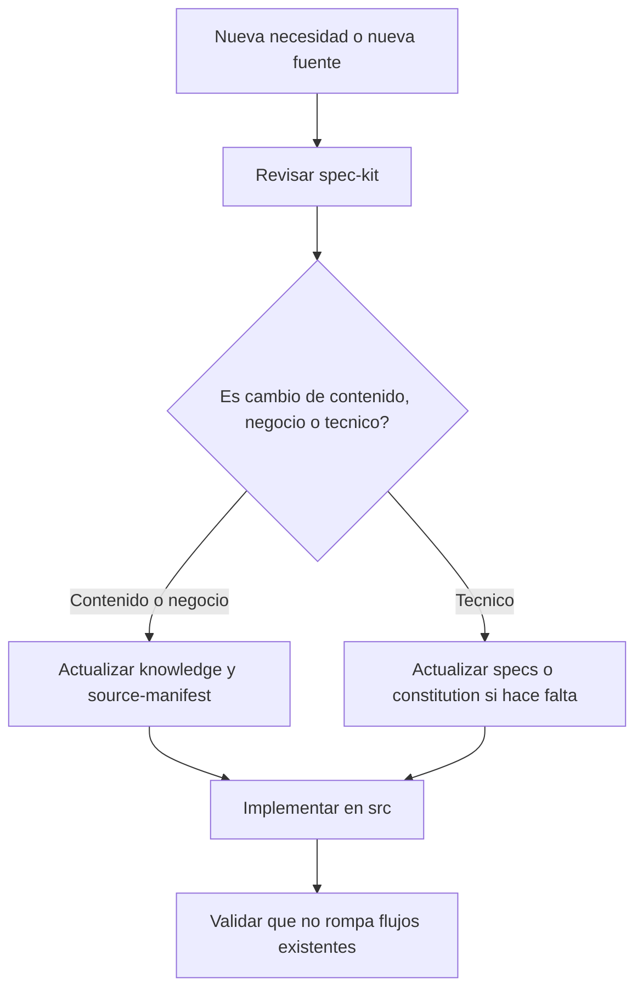
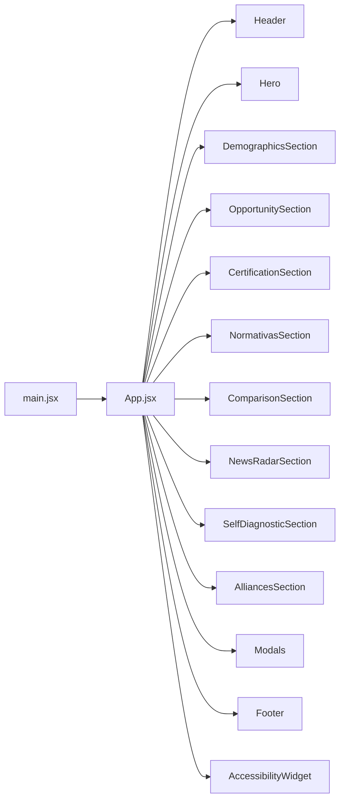
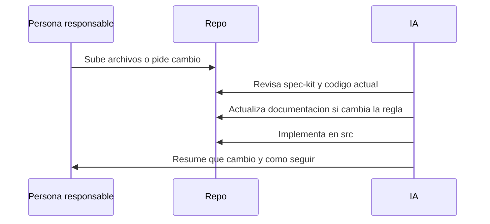

# Age Friend Seal

Guia operativa del proyecto para mantenimiento, contenido y evolucion del codigo.

Este repositorio esta pensado para que una persona pueda:

- actualizar informacion y documentos fuente,
- pedir cambios de producto o de interfaz,
- y delegar a la IA la implementacion tecnica siguiendo reglas consistentes.

La idea no es que cada cambio se improvise. La idea es trabajar con una base clara.

---

## 0. Leer esto primero: que es `spec-kit`

Antes de mirar componentes, estilos o flujos, hay que entender `spec-kit/`.

`spec-kit` es la base documental del proyecto. Ahi vive la logica que ordena todo lo demas:

- que reglas mandan,
- de donde sale la informacion,
- como se actualiza,
- y como debe implementarse en React.

La idea es simple: primero se entiende la regla, despues se toca el codigo.

### Que guarda `spec-kit`

```text
spec-kit/
|- constitution/   # reglas madre y forma de trabajo
|- knowledge/      # sintesis de negocio, legal, producto y fuentes
|- specs/          # reglas tecnicas para implementar en el frontend
```

### Orden de lectura recomendado

Si alguien entra por primera vez a este repo, este es el mejor recorrido:

1. [spec-kit/constitution/constitution.md](spec-kit/constitution/constitution.md)
   - para entender que manda en el proyecto y cuales son los principios base.
2. [spec-kit/constitution/update-workflow.md](spec-kit/constitution/update-workflow.md)
   - para entender como se actualiza sin desordenar el repo.
3. [spec-kit/knowledge/source-manifest.md](spec-kit/knowledge/source-manifest.md)
   - para ver que material fuente ya existe.
4. [spec-kit/knowledge/business-model.md](spec-kit/knowledge/business-model.md)
   - para entender la propuesta y la escalera de valor.
5. [spec-kit/knowledge/product-flows.md](spec-kit/knowledge/product-flows.md)
   - para entender que flujos existen hoy en el sitio.
6. [spec-kit/specs/frontend-architecture.md](spec-kit/specs/frontend-architecture.md)
   - para entender el stack tecnico real.
7. [spec-kit/specs/react-and-component-rules.md](spec-kit/specs/react-and-component-rules.md)
   - para tocar componentes sin romper la organizacion.
8. [spec-kit/specs/scss-and-design-rules.md](spec-kit/specs/scss-and-design-rules.md)
   - para mantener la UI consistente.
9. recien despues `src/`
   - para implementar.

### Regla corta

Si hay una duda entre lo que parece decir el codigo y lo que dice `spec-kit`, primero se revisa `spec-kit`.

---

## 1. Que es este proyecto

`Age Friend Seal` es un frontend en React que presenta la propuesta comercial y tecnica del sello, incluyendo:

- narrativa de economia plateada,
- secciones de posicionamiento,
- autodiagnostico,
- modales de contacto, cuenta y descarga,
- radar de noticias,
- paginas legales,
- materiales descargables.

---

## 2. Stack del proyecto

- `React 19`
- `Vite`
- `SCSS`
- `react-intl`
- `Swiper`
- `html2pdf.js`

---

## 3. Como esta organizado

```text
age-friend-seal/
|- public/
|  |- assets/                  # imagenes, logos, PDFs y materiales publicos
|- info/                       # fuentes crudas: html, docx, pptx, xlsx, audio
|- src/
|  |- components/              # una carpeta por componente
|  |- data/                    # datos estructurados, por ejemplo preguntas
|  |- i18n/                    # textos y traducciones
|  |- styles/                  # capas globales de SCSS
|  |- utils/                   # helpers
|  |- App.jsx                  # orquestacion principal
|  |- main.jsx                 # entrada de React
|- spec-kit/
|  |- constitution/            # reglas madre
|  |- knowledge/               # sintesis de negocio, legal y producto
|  |- specs/                   # reglas tecnicas para implementar
|- HOWTOWORK.md
```

---

## 4. Mapa mental de trabajo



---

## 5. Regla principal

Antes de tocar codigo, mirar `spec-kit/`.

Orden de autoridad:

1. `spec-kit/constitution/`
2. `spec-kit/knowledge/`
3. `spec-kit/specs/`
4. fuentes crudas en `info/` y `public/assets/`
5. codigo en `src/`

Eso significa:

- el codigo implementa reglas,
- no inventa reglas por si solo,
- y si algo importante cambia, primero se documenta y despues se implementa.

---

## 6. Diagrama de arquitectura



---

## 7. Como trabajar sobre el codigo

### Componentes

Cada componente vive en su propia carpeta:

```text
src/components/NombreDelComponente/
|- NombreDelComponente.jsx
|- NombreDelComponente.scss
```

Reglas:

- usar `PascalCase`,
- importar el `.scss` desde el `.jsx`,
- no meter estilos globales dentro del componente salvo que sea realmente global,
- si una seccion crece mucho, separarla en subcomponentes.

### Estilos

Las capas globales viven en `src/styles/`:

- `base.scss`
- `shared.scss`
- `legal.scss`
- `overrides.scss`
- `index.scss`

`index.scss` compone esas capas. Lo nuevo de una seccion normalmente debe vivir en su `Component.scss`.

### Textos

Los textos bilingues van en:

- `src/i18n/es.js`
- `src/i18n/en.js`
- `src/i18n/messages.js`

No conviene hardcodear copy de producto en muchos componentes.

### Datos

Si el contenido es estructurado o repetible, debe vivir fuera del JSX:

- `src/data/`
- `src/utils/`

Ejemplo actual:

- `src/data/diagnostic.js`

---

## 8. Flujo real para hacer cambios



---

## 9. Si queres agregar mas informacion

### Caso A: tenes archivos nuevos

Por ejemplo:

- un `.docx`,
- un `.pdf`,
- una presentacion,
- una planilla,
- un texto legal nuevo.

Lo ideal es:

1. poner el archivo en `info/` o `public/assets/`,
2. avisarme para que lo incorpore al `spec-kit`,
3. yo te voy a mostrar opciones concretas para que elijas donde queres que impacte,
4. las opciones de referencia van a ser:
   - `Constitution`: define las reglas mas importantes del proyecto y como se trabaja.
   - `Knowledge`: guarda contexto, fuentes y explicaciones de negocio, producto o legal.
   - `Business Model`: explica que se vende, a quien, y como se ordena la propuesta de valor.
   - `Specs`: fija como debe implementarse tecnicamente en codigo y diseño.
5. una vez que me lo confirmes, lo inventario y lo bajo a la documentacion correcta,
6. despues te propongo si eso debe solo documentarse o tambien reflejarse en la web.

Ejemplo de pedido:

> Agregue un archivo nuevo en `info/` sobre alianzas institucionales. Incorporalo al spec-kit, resumilo y decime si impacta en alguna seccion actual.

### Caso B: queres cambiar contenido de una seccion

Ejemplo:

> Quiero que la seccion de certificacion explique mejor los 3 niveles. Basate en los documentos del dossier y actualiza tambien el spec-kit.

### Caso C: queres una funcionalidad nueva

Ejemplo:

> Necesito un nuevo bloque con testimonios, usando el mismo estilo visual del sitio y manteniendo i18n.

### Caso D: queres cambiar una regla del producto

Ejemplo:

> Desde ahora el pitch corporativo solo se descarga con usuario logueado y empresa validada. Actualiza la regla, el flujo y la UI.

---

## 10. Como pedirme trabajo de forma clara

No hace falta escribir tecnico. Lo mejor es decir:

1. que queres cambiar,
2. en que parte del sitio,
3. si hay una fuente nueva,
4. y si queres solo propuesta o implementacion directa.

### Plantillas utiles

#### Pedir solo analisis

> Revisa `info/Competencia Age Friend Seal.docx` y decime que partes convendria incorporar al sitio. No implementes todavia.

#### Pedir implementacion

> Usa el contenido de `info/Normativa sobre Silver Economy.docx`, actualiza el spec-kit y despues mejora la seccion de normativas en React.

#### Pedir orden documental

> Tengo 3 archivos nuevos en `info/`. Quiero que los inventaries, los resumas y me propongas donde impactan.

#### Pedir ajuste visual

> Quiero mejorar el espaciado del formulario del autodiagnostico sin cambiar la logica.

---

## 11. Que cosas ya estan definidas

Estas reglas ya quedaron fijadas:

- React es la arquitectura principal.
- No hay que volver a `app.js` legacy.
- Se usa SCSS por componente.
- `react-intl` maneja idioma y copy compartido.
- `Swiper` se usa para sliders o carruseles.
- `spec-kit/` es la base documental del proyecto.

---

## 12. Que deberia hacer alguien no tecnico

Si la persona que administra esto no programa, igual puede trabajar bien asi:

1. junta documentos, PDFs, textos o ideas nuevas,
2. los agrega al repo o me dice cuales son,
3. explica que quiere lograr,
4. yo me encargo de:
   - revisar contexto,
   - actualizar documentacion,
   - cambiar codigo,
   - y contar que quedo hecho.

---

## 13. Regla para no romper el proyecto

No conviene:

- meter HTML suelto por afuera de React,
- duplicar estilos en varios lados,
- crear otra arquitectura paralela,
- agregar librerias sin necesidad,
- cambiar una regla de negocio en codigo sin reflejarlo en `spec-kit`.

---

## 14. Archivos importantes para empezar

- [spec-kit/README.md](spec-kit/README.md)
  - Que hace: presenta la estructura general del `spec-kit` y explica como debe usarse.
  - Por que importa: es la puerta de entrada documental. Sirve para entender rapidamente como se relacionan reglas, conocimiento y especificaciones.

- [spec-kit/constitution/constitution.md](spec-kit/constitution/constitution.md)
  - Que hace: define las reglas madre del proyecto, el orden de autoridad y los principios de cambio.
  - Por que importa: evita que el codigo evolucione sin criterio. Si hay dudas sobre que manda, este archivo decide.

- [spec-kit/constitution/update-workflow.md](spec-kit/constitution/update-workflow.md)
  - Que hace: explica el proceso correcto para incorporar nuevas fuentes, actualizar documentacion y luego implementar cambios.
  - Por que importa: ordena el trabajo para que no se salteen pasos y para que cada cambio quede trazable.

- [spec-kit/knowledge/source-manifest.md](spec-kit/knowledge/source-manifest.md)
  - Que hace: inventaria las fuentes crudas del repo, como HTML, DOCX, PPTX y PDF, y aclara para que podria servir cada una.
  - Por que importa: permite saber de donde sale la informacion y que material ya existe antes de pedir contenido nuevo o tocar UI.

- [spec-kit/specs/frontend-architecture.md](spec-kit/specs/frontend-architecture.md)
  - Que hace: fija el stack tecnico y la arquitectura frontend actual del proyecto.
  - Por que importa: le dice a cualquier persona o IA con que herramientas debe trabajar y que no conviene reintroducir arquitecturas viejas.

- [spec-kit/specs/react-and-component-rules.md](spec-kit/specs/react-and-component-rules.md)
  - Que hace: documenta como deben organizarse los componentes, donde va cada tipo de logica y como crecer sin ensuciar el arbol de `src/`.
  - Por que importa: mantiene consistente la estructura del codigo y evita que cada cambio meta un estilo distinto de programar.

- [spec-kit/specs/scss-and-design-rules.md](spec-kit/specs/scss-and-design-rules.md)
  - Que hace: establece como se reparten los estilos globales y de componente, y que criterios de UI se deben respetar.
  - Por que importa: ayuda a no romper la estetica del sitio y a mantener claro donde toca vivir cada ajuste visual.

- [spec-kit/specs/ai-working-rules.md](spec-kit/specs/ai-working-rules.md)
  - Que hace: define como debe trabajar la IA dentro de este repo, en que orden leer, como decidir y cuando documentar reglas nuevas.
  - Por que importa: hace que futuras intervenciones no dependan del contexto de una sola charla y que la IA siga una forma de trabajo estable.

---

## 15. Resumen corto

Si alguien toma este repo mañana, la forma correcta de operar es:

- primero entender `spec-kit`,
- despues mirar las fuentes,
- despues tocar React,
- y cada cambio importante dejarlo documentado.

Ese es el sistema para que el proyecto siga creciendo sin desordenarse.
